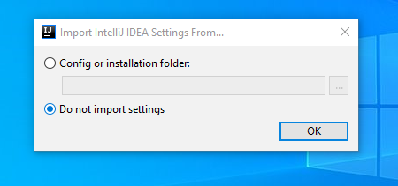
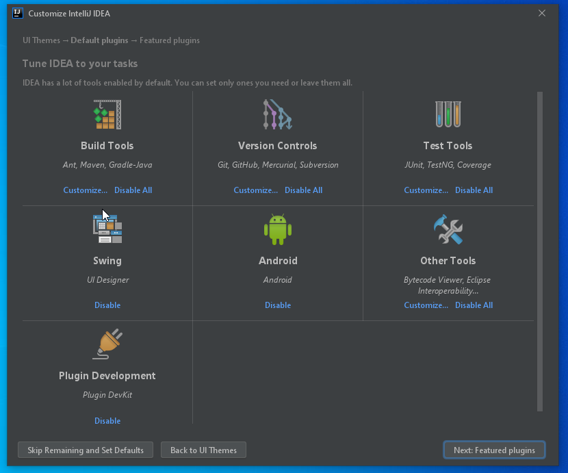
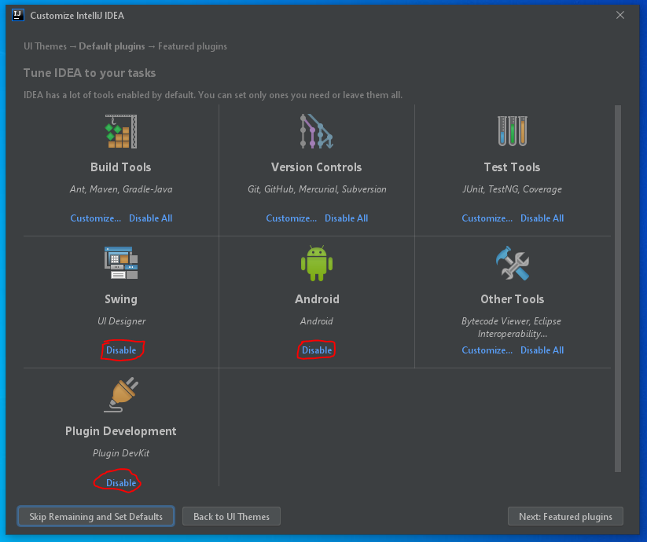
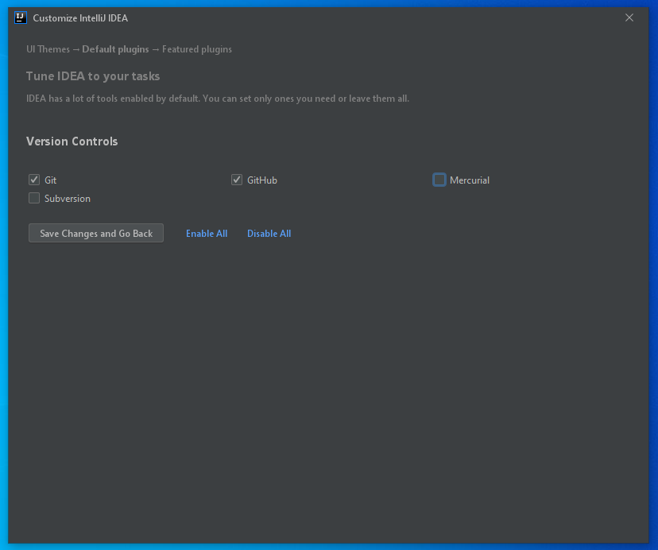
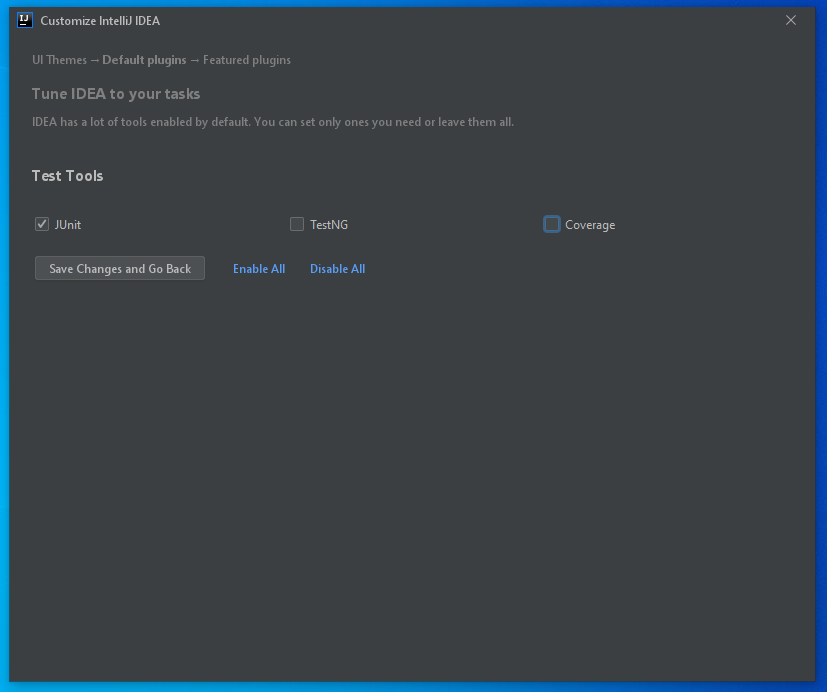
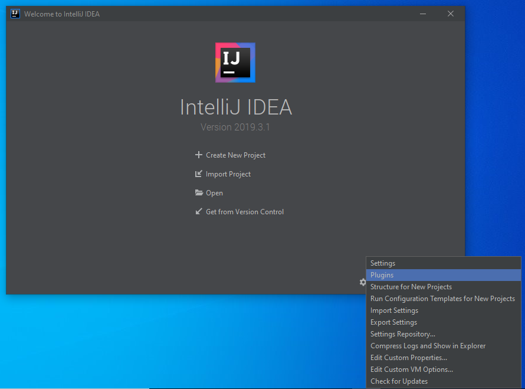
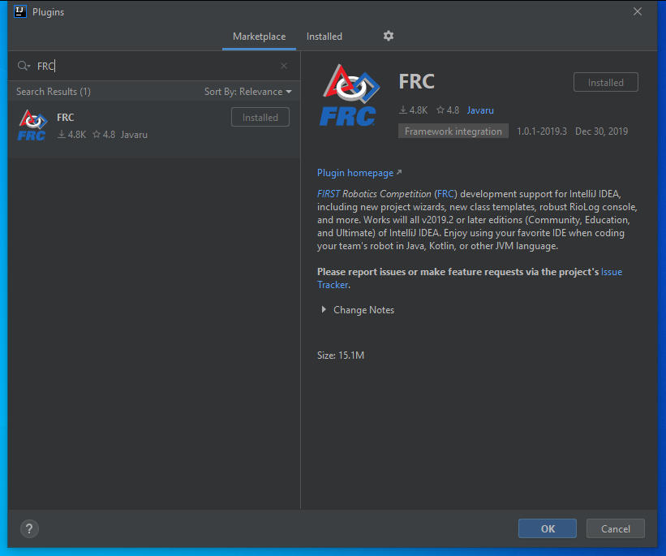
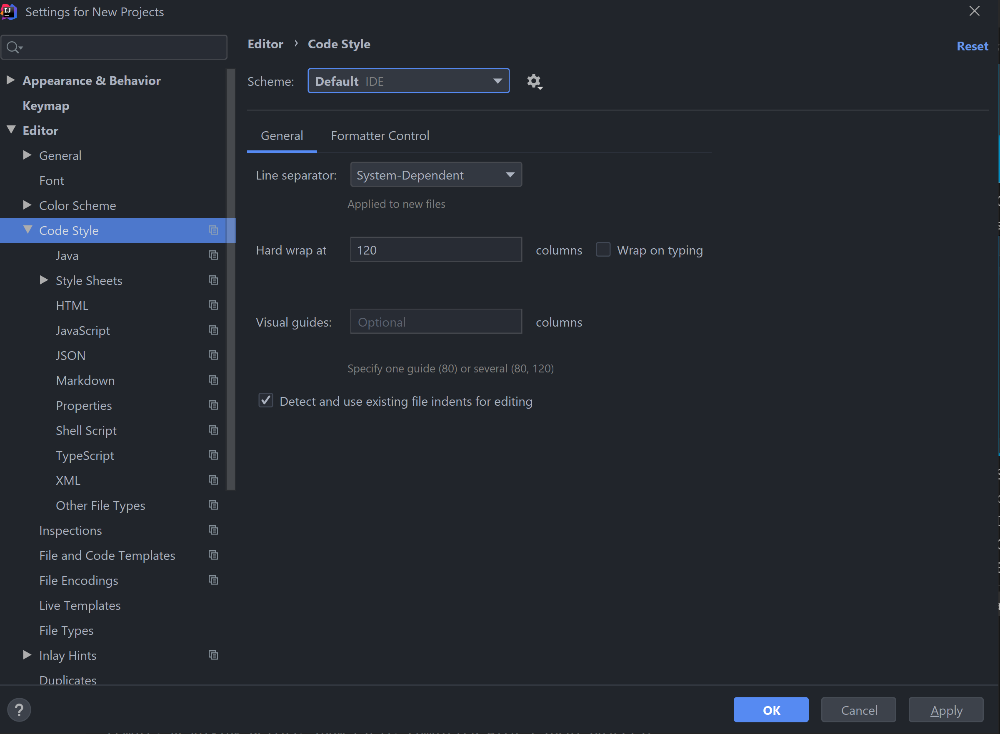
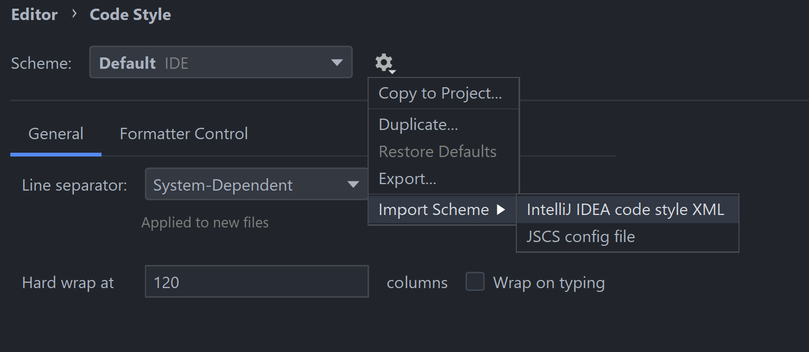

1. Go through the installer until you get to this popup.
  
  Make sure it looks like the image.
2. Keep hitting next until this pops up
  
  Hit disable on Android, Swing, and Plugin Development.
  

* Click on Customize for these sections and follow the images:
  * Version Controls
    
  * Test Tools
    

3. For Featured Plugins, don't install any of them.
4. Once you get to this popup, hit Configure and Plugins
   
5. Change to the Marketplace tab and search for FRC and install the plugin.
   
6. Search for Save Actions and install the plugin.
7. Download [this](https://gist.githubusercontent.com/lukemcd9/10fd4cd23724a5355fbfa8bfeff316bb/raw/5636db05d1265cf4ba8a4c047b064791d4b49783/frc-2445-code-style.xml) (right click link, Save As) Click Configure again, then Settings, Editor, Code Style
   
   Click the settings gear and Import Scheme, IntelliJ IDEA code style XML. Find the file you just downloaded and import it.
   
