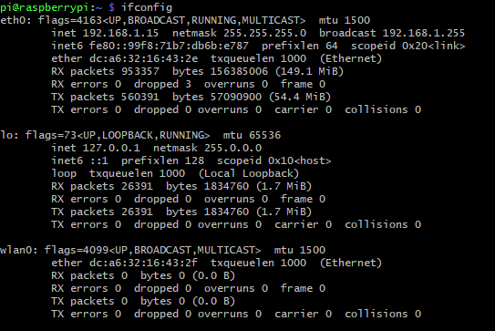

This documentation assumes that you are using a Raspberry Pi that has already been configured for SSH.

1. SSH to the Raspberry Pi by using command `ssh pi@raspberrypi.local` (requires LAN connection to the Pi) and enter its password when prompted.  
    >If you are on Windows, the `ssh` command is only available when using Git Bash, Powershell, or using SSH clients such as PuTTY  
    >Mac users are able to use the `ssh` command directly from their terminal.  

1. Run `ifconfig` on your Pi. Example shown below.
      

    >Take note of the first interface name, we will need it later. In the above example, it's `eth0`.

1. Create a backup of `dhcpcd.conf` in case it's needed later
    ```shell
    sudo cp /etc/dhcpcd.conf /etc/dhcpcd.conf.bak
    ```

1. Clear the contents of the config file
    ```shell
    sudo echo '' > /etc/dhcpcd.conf
    ```

1. Edit the configuration file
    ```shell
    sudo vim /etc/dhcpcd.conf
    ```
    >Other editors such as `nano` can be used in lieu of `vim`.

    Make the file look like below, substituting where necessary
    ```shell
    interface <interface name from earlier>
    static ip_address=<IP address you want, including subnet>
    static routers=<valid gateway IP>
    static domain_name_servers=<valid gateway IP>
    ```

    If I wanted to configure interface eth0 to have the IP 10.24.45.100, my `dhcpcd.conf` would look like below
    ```shell
    interface eth0
    static ip_address=10.24.45.100/24
    static routers=10.24.45.1
    static domain_name_servers=10.24.45.1
    ```

1. You're done! `sudo reboot now` for the changes to take place.